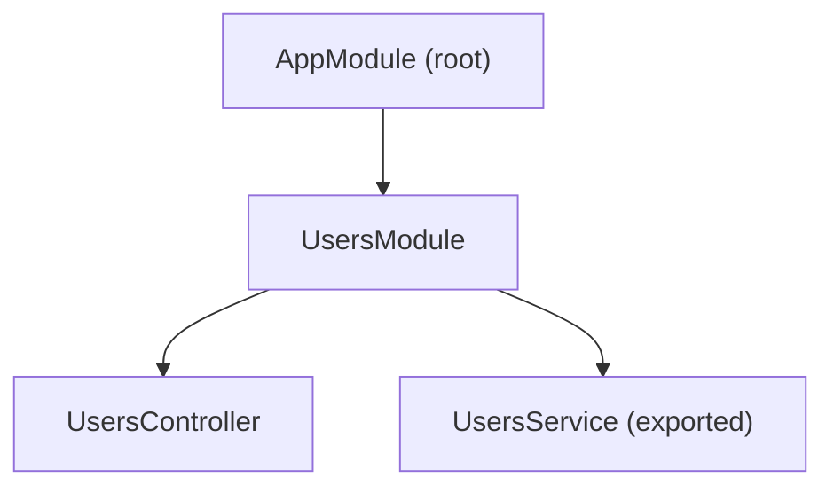

# NestJs

[Nest](https://github.com/nestjs/nest) framework TypeScript starter repository.

## What is NestJS?

### What can you build with it?

NestJS is not limited to building APIs. Instead, it allows you to create three different types of applications:

- **HTTP server applications**
You can create an HTTP server using NestFactory.create() to define request endpoints and effectively build APIs and web servers.

- **Microservices applications**
You can also create microservices using NestFactory.createMicroservice(). These are similar to HTTP server applications, except they can use different transport protocols such as TCP or NATS, and they communicate over an internal network.

- **Standalone applications**
You can create standalone applications using NestFactory.createApplicationContext(). A standalone application does not have a network listener, which makes it ideal for scheduled tasks, background jobs, or even building CLI tools.

All of these application types have one thing in common:
- They require a root module. So let’s talk about modules next.

### Modules
 - Modules are the building blocks of a NestJS application. You can think of a Nest app as a graph of modules. At the top, there is always a root module (usually AppModule), and other feature modules are connected to it.
 - A module is a class decorated with the @Module() decorator.
 - A module can contain multiple controllers.
 - A module can contain multiple providers (services, repositories, helpers, etc.).
 - A module can import other modules (sub-modules / feature modules).
 - A module can export providers so they can be used by other modules.
 - A module does not export “modules” or “controllers” — it exports providers only.

***Basic example***

***app.module.ts***

```ts 
 

import { Module } from '@nestjs/common';
import { UsersModule } from './users/users.module';

@Module({
  imports: [UsersModule], // importing a sub-module
})
export class AppModule {}

```

***episodes.module.ts***

```ts 
import { Module } from '@nestjs/common';
import { UsersController } from './users.controller';
import { UsersService } from './users.service';

@Module({
  controllers: [UsersController],
  providers: [UsersService],
  exports: [UsersService], // exporting provider
})
export class UsersModule {}

```

***users.controller.ts***

```ts

import { Controller, Get } from '@nestjs/common';
import { UsersService } from './users.service';

@Controller('users')
export class UsersController {
  constructor(private readonly usersService: UsersService) {}

  @Get()
  findAll() {
    return this.usersService.getUsers();
  }
}

```

***users.service.ts***

```ts

import { Injectable } from '@nestjs/common';

@Injectable()
export class UsersService {
  getUsers() {
    return ['Ali', 'Ahmed', 'Sara'];
  }
}

```

***How modules connect (mental model)***



- AppModule imports UsersModule
- UsersModule owns its controller & service
- UsersService can be shared with other modules because it’s exported
- One-liner to remember: Modules organize your application, controllers handle requests, and providers contain business logic.

 ### Decorator
 - A decorator is a special kind of function that can be attached to classes, methods, properties, parameters, or accessors.
 - Decorators are used to add metadata to these elements, which NestJS uses to change or define their behavior at runtime.
 - Decorators themselves usually do not modify the logic directly. Instead, they provide metadata that NestJS reads to decide how something should behave.
  - Decorators can be applied to classes, methods, properties, and parameters.
  - They help NestJS understand the role of a class or method (controller, module, route, injectable, etc.).
- ***Analogy:***
Think of decorators as accessories or suits that give special powers.
An empty class by itself does nothing, but once you “dress it up” with decorators like @Module() or @Controller(), NestJS knows how to use it.

***Class decorator – @Module()***

```ts

import { Module } from '@nestjs/common';

@Module({
  controllers: [],
  providers: [],
})
export class AppModule {}
// Without @Module(), this class is just a normal TypeScript class.
// With @Module(), NestJS recognizes it as a module.

```

***Class decorator – @Controller()***

```ts
import { Controller } from '@nestjs/common';

@Controller('users')
export class UsersController {}

// This tells NestJS:
// This class handles HTTP requests for /users

```

***Method decorator – @Get()***

```ts
import { Controller, Get } from '@nestjs/common';

@Controller('users')
export class UsersController {

  @Get()
  findAll() {
    return 'All users';
  }
}

// @Get() adds metadata saying:
// This method should run when a GET request comes to /users

```

***Parameter decorator – @Body()***

```ts
import { Controller, Post, Body } from '@nestjs/common';

@Controller('users')
export class UsersController {

  @Post()
  createUser(@Body() body: any) {
    return body;
  }
}
// @Body() tells NestJS to inject the request body into the parameter.

```

***Property / class decorator – @Injectable()***

```ts
import { Injectable } from '@nestjs/common';

@Injectable()
export class UsersService {
  findUsers() {
    return ['Ali', 'Ahmed'];
  }
}
// @Injectable() marks the class as a provider that can be injected using dependency injection.

```

#### Key takeaway

- Decorators add metadata
- NestJS reads that metadata
- NestJS then decides how to create, connect, and execute your code


### Controllers
 - Controllers are classes annotated with the @Controller() decorator.
 - A controller is responsible for receiving incoming HTTP requests and returning responses.
 - You can define a route prefix in the controller decorator, for example @Controller('users').
 - Inside a controller, methods handle different HTTP requests using decorators such as
@Get(), @Post(), @Put(), and @Delete().
- These HTTP method decorators can optionally take a sub-route as a parameter.

```js
import { Controller, Get } from '@nestjs/common';

@Controller('users')
export class UsersController {

  @Get('test')
  test() {
    return 'test';
  }
}

// How the route works
GET /users/test  →  test()
// @Controller('users') → sets the base route
// @Get('test') → handles GET requests to /users/test

```

The main role of a controller is to receive requests and return responses.
Any business logic, database access, or complex processing should be delegated to services or other providers.

### Providers

- Most of the application logic in NestJS lives inside providers.
- A provider is a class that can be injected into other classes (such as controllers or other providers) using NestJS’s dependency injection system.
- Providers usually contain business logic, data access, or reusable functionality.
- A common example of a provider is a service, such as UsersService.

***Basic Example***

```js


import { Injectable } from '@nestjs/common';

@Injectable()
export class UsersService {
  getUsers() {
    return ['Ali', 'Ahmed', 'Sara'];
  }
}


```

- What @Injectable() does: Marks the class as a provider, Allows NestJS to manage its lifecycle and Makes the class available for dependency injection

***Registering the provider in a module***

```js


import { Module } from '@nestjs/common';
import { UsersController } from './users.controller';
import { UsersService } from './users.service';

@Module({
  controllers: [UsersController],
  providers: [UsersService],
  exports: [UsersService], // allows other modules to use it
})
export class UsersModule {}

// providers → registers the provider in this module
// exports → makes the provider available to other modules that import this module

```

***Injecting the provider into a controller***

```js


import { Controller, Get } from '@nestjs/common';
import { UsersService } from './users.service';

@Controller('users')
export class UsersController {
  constructor(private readonly usersService: UsersService) {}

  @Get()
  findAll() {
    return this.usersService.getUsers();
  }
}

// NestJS automatically injects UsersService into the controller
// You don’t manually create instances (new UsersService() is never used)


```

***Dependency Injection & Singleton behavior***

- NestJS uses dependency injection (DI) to provide instances of providers.
- By default, providers are singletons per module: One instance is created, The same instance is shared wherever it’s injected


### Middleware

- When you travel by plane, you don’t go straight to your seat.
You pass through check-in, security, border control, and boarding before finally getting on the plane.
- In the same way, an HTTP request in NestJS can pass through multiple stages before it reaches the controller’s route handler.
- These stages are handled using middleware.
- Middleware runs before the request is handled by the controller.
- Common use cases include:
 - logging incoming requests
 - authentication
 - request transformation
 - adding headers or metadata
- Regarding NestJs, Middleware is a function (or class) that has access to the request, response, and the next function, and runs before the route handler.

***Create middleware (logger.middleware.ts)***

```js

import { Injectable, NestMiddleware } from '@nestjs/common';
import { Request, Response, NextFunction } from 'express';

@Injectable()
export class LoggerMiddleware implements NestMiddleware {
  use(req: Request, res: Response, next: NextFunction) {
    console.log(`${req.method} ${req.originalUrl}`);
    next(); // pass control to the next stage
  }
}

```

***Apply middleware in a module (app.module.ts)***

```js


import { Module, MiddlewareConsumer, NestModule } from '@nestjs/common';
import { LoggerMiddleware } from './logger.middleware';

@Module({})
export class AppModule implements NestModule {
  configure(consumer: MiddlewareConsumer) {
    consumer
      .apply(LoggerMiddleware)
      .forRoutes('*'); // apply to all routes
  }
}

```

- What happens now?: For a request like: GET /users
- The flow becomes:
 - Request LoggerMiddleware
 - Controller
 - Response

### Guards

- Guards are a critical part of the request lifecycle in a NestJS application
- Guards act like security checks at an airport.
- Their primary purpose is to determine whether a request should be handled by the route handler or not.
- Guards run after middleware but before the controller method.
- They have access to the ExecutionContext, which allows them to inspect:
 - the incoming request
 - the user
 - route metadata (roles, permissions, etc.)
- A guard must return:
 - true → request is allowed to proceed
 - false → request is denied (NestJS throws a 403 Forbidden by default)
- Typical use cases:
 - authentication
 - authorization (roles & permissions)
 - feature access control
 - custom business rules

***How guards fit in the request flow?***
```js

Request
 → Middleware
 → Guard
 → Controller
 → Response

```
***Example 1: Simple authentication guard***

```js

import { CanActivate, ExecutionContext, Injectable } from '@nestjs/common';

@Injectable()
export class AuthGuard implements CanActivate {
  canActivate(context: ExecutionContext): boolean {
    const request = context.switchToHttp().getRequest();

    // Example check (very simplified)
    return !!request.headers.authorization;
  }
}

// If authorization header exists → allow request
// If not → deny request
```

***Apply the guard to a route***

```js
import { Controller, Get, UseGuards } from '@nestjs/common';
import { AuthGuard } from './auth.guard';

@Controller('users')
export class UsersController {

  @Get()
  @UseGuards(AuthGuard)
  findAll() {
    return 'Protected users list';
  }
}
// Request with Authorization header → ✅ allowed
// Request without it → ❌ 403 Forbidden

```

***Example 2: Role-based guard (Authorization)***
***Create a custom decorator***

```js

import { SetMetadata } from '@nestjs/common';

export const Roles = (...roles: string[]) => SetMetadata('roles', roles);


```

***Create the guard***

```js

import { CanActivate, ExecutionContext, Injectable } from '@nestjs/common';
import { Reflector } from '@nestjs/core';

@Injectable()
export class RolesGuard implements CanActivate {
  constructor(private reflector: Reflector) {}

  canActivate(context: ExecutionContext): boolean {
    const requiredRoles = this.reflector.get<string[]>(
      'roles',
      context.getHandler(),
    );

    if (!requiredRoles) {
      return true;
    }

    const request = context.switchToHttp().getRequest();
    const user = request.user;

    return requiredRoles.includes(user?.role);
  }
}


```

***Use the guard + decorator***

```js

import { Controller, Get, UseGuards } from '@nestjs/common';
import { Roles } from './roles.decorator';
import { RolesGuard } from './roles.guard';

@Controller('admin')
@UseGuards(RolesGuard)
export class AdminController {

  @Get()
  @Roles('admin')
  getAdminData() {
    return 'Admin only data';
  }
}


```

### Interceptors
- Interceptors are executed after guards and before and after the route handler (controller method).
- They allow you to intercept and transform both the incoming request and the outgoing response.
- Interceptors give you fine-grained control over the request–response lifecycle.
- An interceptor is a class that implements the NestInterceptor interface.
- Interceptors can run before and after route handlers
- Interceptors sit around your route handler, letting you observe, modify, or extend both the request and the response.
- Common use cases include:
 - logging request and response data
 - transforming or mapping response objects
 - caching responses
 - measuring execution time
 - extending or overriding method behavior

***Where interceptors fit in the lifecycle***

```scss

Request
 → Middleware
 → Guard
 → Interceptor (before)
 → Controller
 → Interceptor (after)
 → Response

```

***Example 1: Logging interceptor***

**Create an interceptor**

```js

import {
  Injectable,
  NestInterceptor,
  ExecutionContext,
  CallHandler,
} from '@nestjs/common';
import { Observable } from 'rxjs';
import { tap } from 'rxjs/operators';

@Injectable()
export class LoggingInterceptor implements NestInterceptor {
  intercept(
    context: ExecutionContext,
    next: CallHandler,
  ): Observable<any> {
    const request = context.switchToHttp().getRequest();
    const { method, url } = request;
    const startTime = Date.now();

    return next.handle().pipe(
      tap(() => {
        const duration = Date.now() - startTime;
        console.log(`${method} ${url} - ${duration}ms`);
      }),
    );
  }
}

```

**Apply the interceptor**

```js

import { Controller, Get, UseInterceptors } from '@nestjs/common';
import { LoggingInterceptor } from './logging.interceptor';

@Controller('users')
export class UsersController {

  @Get()
  @UseInterceptors(LoggingInterceptor)
  findAll() {
    return 'Users list';
  }
}

```

***Example 2: Response transformation interceptor***

```js

import {
  Injectable,
  NestInterceptor,
  ExecutionContext,
  CallHandler,
} from '@nestjs/common';
import { Observable } from 'rxjs';
import { map } from 'rxjs/operators';

@Injectable()
export class TransformInterceptor implements NestInterceptor {
  intercept(
    context: ExecutionContext,
    next: CallHandler,
  ): Observable<any> {
    return next.handle().pipe(
      map(data => ({
        success: true,
        data,
      })),
    );
  }
}

// Response before interceptor

["Ali", "Ahmed"]

// Response after interceptor

{
  "success": true,
  "data": ["Ali", "Ahmed"]
}

```


***Interceptors vs Guards vs Middleware (quick clarity)***

- Middleware → preprocess request
- Guards → allow or deny access
- Interceptors → wrap execution & transform response
- Pipes → validate & transform input

### Pipes
[Documentation](https://docs.nestjs.com/websockets/pipes#binding-pipes)

- Pipes are used to validate and transform data before it reaches the route handler.
- They run after guards and before the controller method.
- Pipes operate on method parameters (such as @Body(), @Param(), @Query()).
- A pipe is a class that implements the PipeTransform interface and is usually annotated with @Injectable().
- Pipes can:
 - validate incoming data against rules or constraints
 - transform data into a more suitable format for processing
- If validation fails, a pipe can throw an exception, which stops the request and prevents the route handler from executing.

***Where pipes fit in the lifecycle?***

```scss

Request
 → Middleware
 → Guard
 → Interceptor (before)
 → Pipe
 → Controller
 → Interceptor (after)
 → Response

```
***Example 1: Built-in pipe – ParseIntPipe***

```ts

import { Controller, Get, Param, ParseIntPipe } from '@nestjs/common';

@Controller('users')
export class UsersController {

  @Get(':id')
  findOne(@Param('id', ParseIntPipe) id: number) {
    return `User ID is ${id}`;
  }
}

```
***What happens here?***

- Incoming request: GET /users/10
- id is received as a string "10"
- ParseIntPipe converts it into a number 10
- If conversion fails → NestJS throws 400 Bad Request

***Example 2: Validation pipe using DTOs***

***Create a DTO***

```ts

import { IsEmail, IsNotEmpty } from 'class-validator';

export class CreateUserDto {
  @IsEmail()
  email: string;

  @IsNotEmpty()
  name: string;
}

```

***Use ValidationPipe***

```ts

import { Controller, Post, Body, UsePipes, ValidationPipe } from '@nestjs/common';
import { CreateUserDto } from './create-user.dto';

@Controller('users')
export class UsersController {

  @Post()
  @UsePipes(new ValidationPipe())
  create(@Body() body: CreateUserDto) {
    return body;
  }
}

// If request body is invalid:

{
  "email": "not-an-email",
  "name": ""
}
// Response: 400 Bad Request

```

***Example 3: Custom pipe***

```ts

import { PipeTransform, Injectable, BadRequestException } from '@nestjs/common';

@Injectable()
export class TrimPipe implements PipeTransform {
  transform(value: any) {
    if (typeof value !== 'string') {
      return value;
    }

    return value.trim();
  }
}

// Use the custom pipe

@Post()
create(@Body('name', TrimPipe) name: string) {
  return name;
}

```
***Validation vs Transformation***

- Validation → check if data is acceptable
- Transformation → change data format
- Pipes can do both.

## Pipes vs other NestJS features (quick clarity)

- Middleware → preprocess request
- Guards → allow or deny access
- Pipes → validate & transform input
- Interceptors → wrap execution & transform output
- Pipes protect your route handlers by ensuring incoming data is valid, clean, and correctly formatted.

## Exception Filters

- Exception Filters are classes that implement the ExceptionFilter interface.
- They are decorated with the @Catch() decorator.
- Exception filters can catch exceptions thrown from any part of the request lifecycle, including:
 - guards
 - interceptors
 - pipes
 - route handlers (controllers)
- When an exception is caught, the filter determines:
 - how the error is handled
 - what response is sent to the client
- A common use case is a global exception filter that:
 - catches all unhandled exceptions
 - logs error details for debugging
 - returns a standardized error response
 - prevents sensitive internal details from being exposed
- This ensures:
 - consistent error messages for clients
 - better security
 - happier frontend developers 🎉
- Exception filters provide a centralized and structured way to handle errors while keeping the application stable and secure.

***Where exception filters fit in the lifecycle?***
```nginx
Request
 → Middleware
 → Guard
 → Interceptor
 → Pipe
 → Controller
 → Exception Filter (on error)
 → Response

```
***Example 1: Catching a specific exception***

***Create an exception filter***

```ts
import {
  ExceptionFilter,
  Catch,
  ArgumentsHost,
  HttpException,
} from '@nestjs/common';
import { Request, Response } from 'express';

@Catch(HttpException)
export class HttpExceptionFilter implements ExceptionFilter {
  catch(exception: HttpException, host: ArgumentsHost) {
    const ctx = host.switchToHttp();
    const response = ctx.getResponse<Response>();
    const request = ctx.getRequest<Request>();

    const status = exception.getStatus();
    const errorResponse = exception.getResponse();

    response.status(status).json({
      statusCode: status,
      timestamp: new Date().toISOString(),
      path: request.url,
      error: errorResponse,
    });
  }
}

```
***Apply the filter to a controller***

```ts

import { Controller, Get, UseFilters, BadRequestException } from '@nestjs/common';
import { HttpExceptionFilter } from './http-exception.filter';

@Controller('users')
@UseFilters(HttpExceptionFilter)
export class UsersController {

  @Get()
  findAll() {
    throw new BadRequestException('Invalid request');
  }
}

```

***Example 2: Global exception filter***

***Create a global filter***

```ts
import {
  ExceptionFilter,
  Catch,
  ArgumentsHost,
  HttpStatus,
} from '@nestjs/common';

@Catch()
export class AllExceptionsFilter implements ExceptionFilter {
  catch(exception: any, host: ArgumentsHost) {
    const ctx = host.switchToHttp();
    const response = ctx.getResponse();
    const request = ctx.getRequest();

    const status =
      exception.status || HttpStatus.INTERNAL_SERVER_ERROR;

    response.status(status).json({
      success: false,
      statusCode: status,
      message: exception.message || 'Internal server error',
      path: request.url,
    });
  }
}

```

***Register globally (main.ts)***

```ts

import { NestFactory } from '@nestjs/core';
import { AppModule } from './app.module';
import { AllExceptionsFilter } from './all-exceptions.filter';

async function bootstrap() {
  const app = await NestFactory.create(AppModule);
  app.useGlobalFilters(new AllExceptionsFilter());
  await app.listen(3000);
}
bootstrap();

```

***Example 3: Error response consistency***

```json

{
  "statusCode": 400,
  "message": "Invalid request"
}

```

***With exception filter***

```json

{
  "success": false,
  "statusCode": 400,
  "message": "Invalid request",
  "path": "/users"
}


```

***Key things to remember***

- Exception filters only run when an error is thrown
- They can be:
 - method-scoped
 - controller-scoped
 - global
- They should not contain business logic
- They help enforce security and consistency

***Exception Filters vs other NestJS features (quick clarity)***
- Pipes → validate input
- Guards → allow or deny access
- Interceptors → wrap execution
- Exception Filters → handle errors
- Exception filters give you a centralized, secure, and consistent way to handle errors across your NestJS application.

## Nest Install

```bash
npm i -g @nestjs/cli
nest new nest-app-v2
cd nest-app-v2
npm run start
```

## Packages

```bash
npm install --save typeorm pg @nestjs/typeorm
npm install --save @nestjs/jwt

# generate
node -e "console.log(require('crypto').randomBytes(64).toString('hex'))"
```

## Migration

```bash
# Update Table
# 1) Change the entity – add/rename/remove columns (or relations) in the right .entity.ts file like
# src/countries/entities/country.entity.ts
# 2) Generate the migration (TypeORM compares entities with the DB and writes the migration):
# Then run the command like below
npm run migration:generate -- src/database/migrations/UpdateCountriesTableWithAddColumnGeonameidAndUpdatedAt
# Then run
npm run migration:run
```

## Create Module, Service and Controllers

```bash
nest g module users
nest g controller users
nest g service users
```

## Project setup

```bash
$ npm install
```

## Compile and run the project

```bash
# development
$ npm run start

# watch mode
$ npm run start:dev

# production mode
$ npm run start:prod
```

## Run tests

```bash
# unit tests
$ npm run test

# e2e tests
$ npm run test:e2e

# test coverage
$ npm run test:cov
```

## Deployment

When you're ready to deploy your NestJS application to production, there are some key steps you can take to ensure it runs as efficiently as possible. Check out the [deployment documentation](https://docs.nestjs.com/deployment) for more information.

If you are looking for a cloud-based platform to deploy your NestJS application, check out [Mau](https://mau.nestjs.com), our official platform for deploying NestJS applications on AWS. Mau makes deployment straightforward and fast, requiring just a few simple steps:

```bash
$ npm install -g @nestjs/mau
$ mau deploy
```

With Mau, you can deploy your application in just a few clicks, allowing you to focus on building features rather than managing infrastructure.

## Resources

Check out a few resources that may come in handy when working with NestJS:

- Visit the [NestJS Documentation](https://docs.nestjs.com) to learn more about the framework.
- For questions and support, please visit our [Discord channel](https://discord.gg/G7Qnnhy).
- To dive deeper and get more hands-on experience, check out our official video [courses](https://courses.nestjs.com/).
- Deploy your application to AWS with the help of [NestJS Mau](https://mau.nestjs.com) in just a few clicks.
- Visualize your application graph and interact with the NestJS application in real-time using [NestJS Devtools](https://devtools.nestjs.com).
- Need help with your project (part-time to full-time)? Check out our official [enterprise support](https://enterprise.nestjs.com).
- To stay in the loop and get updates, follow us on [X](https://x.com/nestframework) and [LinkedIn](https://linkedin.com/company/nestjs).
- Looking for a job, or have a job to offer? Check out our official [Jobs board](https://jobs.nestjs.com).

## Support

Nest is an MIT-licensed open source project. It can grow thanks to the sponsors and support by the amazing backers. If you'd like to join them, please [read more here](https://docs.nestjs.com/support).

## Stay in touch

- Author - [Kamil Myśliwiec](https://twitter.com/kammysliwiec)
- Website - [https://nestjs.com](https://nestjs.com/)
- Twitter - [@nestframework](https://twitter.com/nestframework)

## License

Nest is [MIT licensed](https://github.com/nestjs/nest/blob/master/LICENSE).
